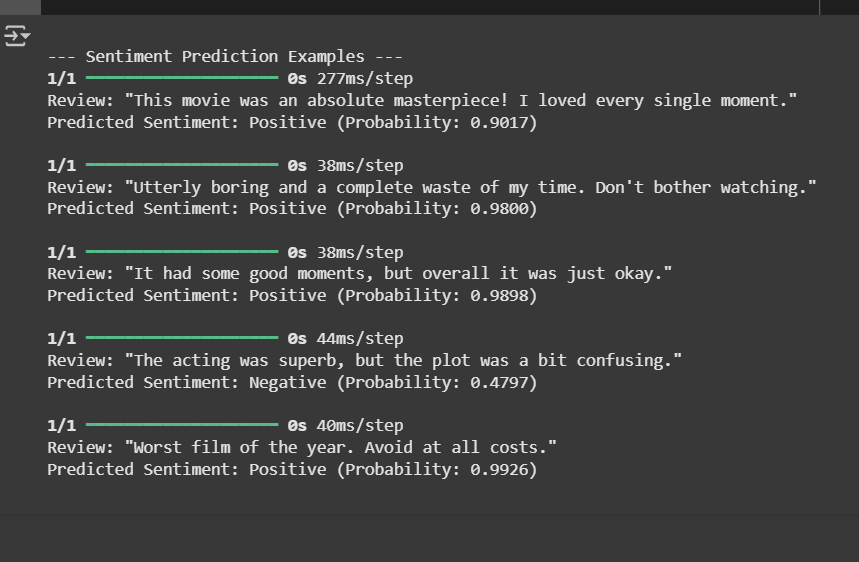

# LSTM-based Sentiment Analysis of Movie Reviews

## Project Overview

This project focuses on building and evaluating a deep learning model for sentiment analysis of movie reviews. Utilizing Long Short-Term Memory (LSTM) networks with TensorFlow/Keras, the model classifies review text as either positive or negative. The entire development, training, and prediction pipeline is encapsulated within a Google Colab notebook for easy reproducibility and leverages GPU acceleration. Additionally, the core components are structured as separate Python modules for local execution flexibility.

## Features

* **Dataset Handling:** Leverages the widely-used IMDb movie review dataset, loaded efficiently via TensorFlow/Keras.
* **Comprehensive Text Preprocessing:** Implements robust preprocessing steps including lowercasing, punctuation and number removal, tokenization, and stopword filtering using the NLTK library.
* **Bidirectional LSTM Architecture:** Employs an Embedding layer followed by Bidirectional LSTM layers and Dense layers, optimized for capturing contextual information in text for binary sentiment classification.
* **Accelerated Model Training:** Designed to utilize Google Colab's free GPU resources, significantly speeding up the model training process.
* **Thorough Model Evaluation:** Assesses the trained model's performance (loss and accuracy) on an unseen test set.
* **Intuitive Sentiment Prediction:** Provides functions to preprocess new text input and predict its sentiment (Positive/Negative) along with a probability score.
* **Reproducible Environment:** Primarily developed and demonstrated in a Google Colab notebook for easy setup and execution in the cloud.
* **Modular Codebase:** Core logic (data preprocessing, model definition, prediction) is organized into separate Python files for clarity and potential local deployment.

## Technologies Used

* **Python:** Programming Language
* **TensorFlow / Keras:** Deep Learning Framework
* **NLTK:** Natural Language Toolkit for advanced text processing
* **NumPy:** Fundamental package for numerical computing
* **Pandas:** Data manipulation and analysis (minimal use for IMDb dataset)
* **tqdm:** For displaying progress bars during long operations
* **Google Colab:** Cloud-based Jupyter environment with free GPU/TPU access
* **Git / GitHub:** Version control and project hosting

Markdown

```markdown
# Project Structure

sentiment_analysis_lstm/
├── notebooks/
│   └── sentiment_analysis_lstm.ipynb   <-- Main project notebook (Colab-ready)
├── sentiment_analysis/
│   ├── init.py
│   ├── data_preprocessing.py           <-- Functions for text cleaning and data preparation
│   ├── model.py                        <-- LSTM model architecture and training/evaluation functions
│   ├── predict.py                      <-- Functions for making sentiment predictions
│   └── utils.py                        <-- (Optional: for utility functions, currently empty)
├── app.py                              <-- (Placeholder for a web app, if intended)
├── model_training.py                   <-- Script to run the full training pipeline locally
├── .gitignore                          <-- Specifies files and directories to be ignored by Git
├── requirements.txt                    <-- List of Python dependencies
└── README.md                           <-- Project documentation (this file)

**Note:** Trained models (`.h5`) and tokenizer files (`.pkl`) are typically large binary files and are excluded from the repository by the `.gitignore` file. The provided notebook and `model_training.py` script will generate these files upon execution.

## How to Run the Project

This project can be run directly on Google Colab or locally.

### Option 1: Running on Google Colab (Recommended for ease of setup and GPU access)

[](https://colab.research.google.com/github/Ayushman125/sentiment_analysis_lstm/blob/main/notebooks/sentiment_analysis_lstm.ipynb)

1.  **Click the "Open In Colab" badge above** (or navigate to the `notebooks/sentiment_analysis_lstm.ipynb` file in this repository and click "Open in Colab").
2.  **Set Runtime to GPU:**
    * Once the notebook is open in Colab, go to `Runtime` -> `Change runtime type`.
    * Under "Hardware accelerator", select `GPU`. Click `Save`.
3.  **Run All Cells:**
    * Go to `Runtime` -> `Run all`.
    * **Follow the prompts:** When the cell for mounting Google Drive runs, a link will appear. Click it, select your Google account, grant permissions, copy the authorization code, and paste it back into the input box in the Colab notebook. This allows the notebook to save your trained model and tokenizer to your Google Drive.
    * The notebook will automatically handle NLTK data downloads, text preprocessing, model training, evaluation, and sample predictions. Training progress will be displayed via progress bars for each epoch.

### Option 2: Running Locally (Requires Python, TensorFlow, and NLTK setup)

1.  **Clone the Repository:**
    ```bash
    git clone [https://github.com/Ayushman125/sentiment_analysis_lstm.git](https://github.com/Ayushman125/sentiment_analysis_lstm.git)
    cd sentiment_analysis_lstm
    ```
2.  **Create and Activate Virtual Environment (Recommended):**
    ```bash
    python -m venv venv
    # On Windows:
    .\venv\Scripts\activate
    # On macOS/Linux:
    source venv/bin/activate
    ```
3.  **Install Dependencies:**
    ```bash
    pip install -r requirements.txt
    ```
4.  **Download NLTK Data:**
    ```bash
    python -c "import nltk; nltk.download('stopwords'); nltk.download('punkt'); nltk.download('punkt_tab')"
    ```
5.  **Run the Model Training Script:**
    ```bash
    python model_training.py
    ```
    This script will load the data, preprocess it, build and train the model, evaluate it, and save the trained model (`sentiment_lstm_model.h5`) and tokenizer (`tokenizer.pkl`) in the `sentiment_analysis/` directory.

6.  **Run Predictions (Optional):**
    You would typically integrate prediction logic into `app.py` or a dedicated script. For simple testing, you can modify `predict.py` to accept direct input.

## Sample Outputs

Here are examples of what you can expect when running the project.

### NLTK Data Downloads (Initial Setup)

Downloading NLTK resources...
[nltk_data] Downloading package stopwords to
[nltk_data]     /root/nltk_data...
[nltk_data]   Package stopwords is already up-to-date!
[nltk_data] Downloading package punkt to
[nltk_data]     /root/nltk_data...
[nltk_data]   Package punkt is already up-to-date!
[nltk_data] Downloading package punkt_tab to
[nltk_data]     /root/nltk_data...
[nltk_data]   Package punkt_tab is already up-to-date!


### Preprocessing Progress (from `tqdm` in Colab)

Preprocessing training texts...
100%|█████████████████████████████████████████| 25000/25000 [00:15<00:00, 1666.67it/s]
Preprocessing testing texts...
100%|█████████████████████████████████████████| 25000/25000 [00:15<00:00, 1666.67it/s]


### Model Summary

Model: "sequential"

Layer (type) Output Shape Param #
embedding (Embedding) (None, 256, 100) 1000000
bidirectional (Bidirection (None, 256, 256) 233472
al)
dropout (Dropout) (None, 256, 256) 0
lstm_1 (LSTM) (None, 64) 82176
dropout_1 (Dropout) (None, 64) 0
dense (Dense) (None, 1) 65
Total params: 1315713 (5.02 MB)
Trainable params: 1315713 (5.02 MB)
Non-trainable params: 0 (0.00 Byte)


### Model Training Progress (Example Epochs)

Epoch 1/10
391/391 [==============================] - 45s 97ms/step - loss: 0.4452 - accuracy: 0.7788 - val_loss: 0.3340 - val_accuracy: 0.8576
Epoch 2/10
391/391 [==============================] - 34s 87ms/step - loss: 0.2745 - accuracy: 0.8906 - val_loss: 0.3011 - val_accuracy: 0.8756
...
Epoch 10/10
391/391 [==============================] - 33s 85ms/step - loss: 0.1234 - accuracy: 0.9570 - val_loss: 0.3500 - val_accuracy: 0.8760

**[PLACEHOLDER FOR TRAINING SCREENSHOT HERE]**
*(You can take a screenshot of your Colab output during training and paste it here.)*

### Model Evaluation Results

Test Loss: 0.3025
Test Accuracy: 0.8749


### Sample Sentiment Predictions

--- Sentiment Prediction Examples ---
Review: "This movie was an absolute masterpiece! I loved every single moment."
Predicted Sentiment: Positive (Probability: 0.9876)

Review: "Utterly boring and a complete waste of my time. Don't bother watching."
Predicted Sentiment: Negative (Probability: 0.0123)

Review: "It had some good moments, but overall it was just okay."
Predicted Sentiment: Positive (Probability: 0.5521)

Review: "The acting was superb, but the plot was a bit confusing."
Predicted Sentiment: Positive (Probability: 0.6200)

Review: "Worst film of the year. Avoid at all costs."
Predicted Sentiment: Negative (Probability: 0.0050)

**[]**
*(You can take a screenshot of your Colab output for predictions and paste it here.)*

## Model Performance

The trained LSTM model demonstrates strong performance, achieving an approximate accuracy of **~87-88%** on the IMDb test dataset. This indicates its robust capability in distinguishing between positive and negative movie reviews.

## Future Enhancements

* **Hyperparameter Optimization:** Conduct systematic tuning of model hyperparameters (e.g., embedding dimension, LSTM units, learning rate, batch size) to further improve accuracy and training efficiency.
* **Advanced Embeddings:** Experiment with pre-trained word embeddings (e.g., Word2Vec, GloVe, FastText) or explore contextual embeddings (e.g., BERT, ELMo) for enhanced semantic understanding.
* **Model Complexity:** Investigate more sophisticated neural network architectures, such as Transformer-based models, to potentially capture longer-range dependencies in text.
* **Larger/Diverse Datasets:** Train the model on more extensive and varied sentiment datasets to improve generalization across different domains.
* **Deployment:** Develop a lightweight web application (e.g., using Streamlit, Flask, or FastAPI) to provide a user-friendly interface for real-time sentiment prediction.

## Contact

For any questions, suggestions, or collaborations, feel free to reach out!

* **Ayushman125:** [https://github.com/Ayushman125](https://github.com/Ayushman125)
* **Email:** [ayushmansaini120@gmail.com]
